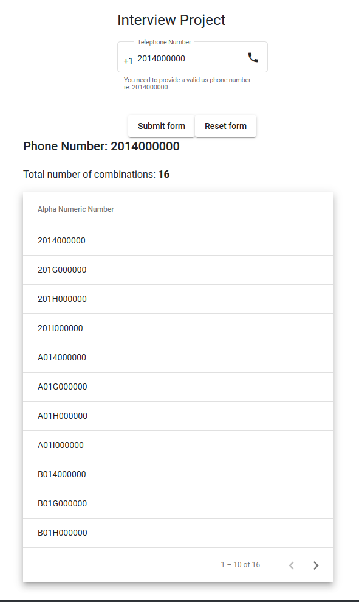

After running generate-resources you manually need to start the ng server.

Most of the implementation could have been done client side but split everything between the two to have the page navigation working appropriately

1. Start the static app server using `./ng build --watch`
2. Start the SpringBootApplication
3. Open `localhost:9089`
4. You should see just an input on the page providing a valid US number and submitting the form will render the rest of the information above.
